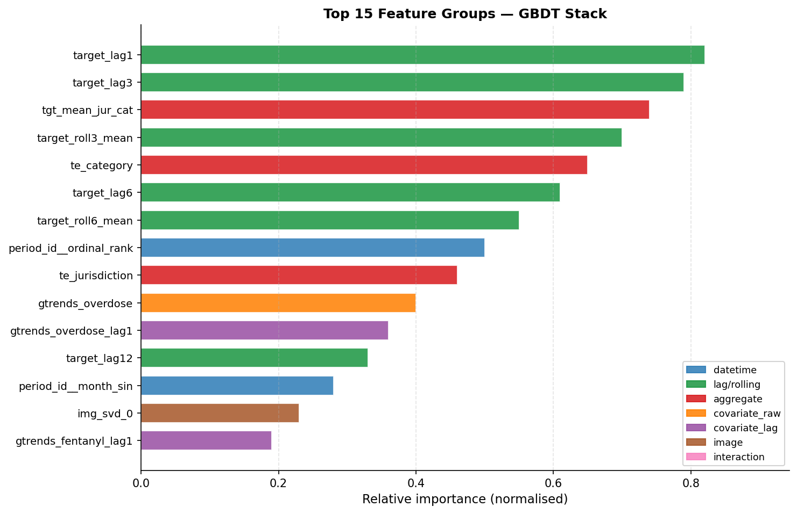
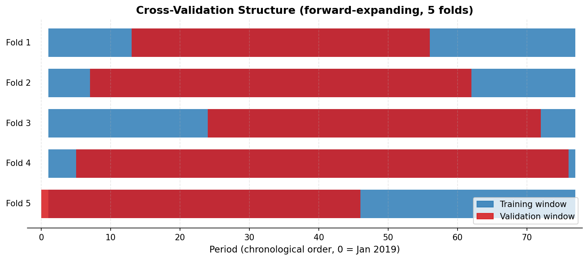
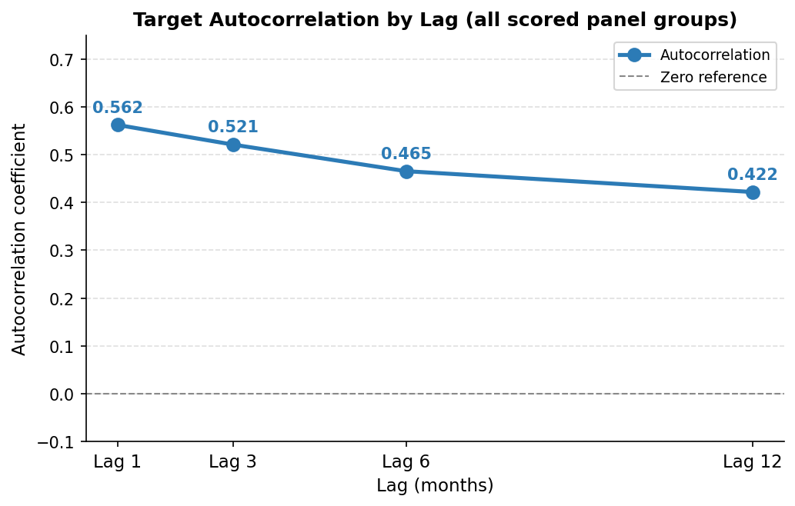
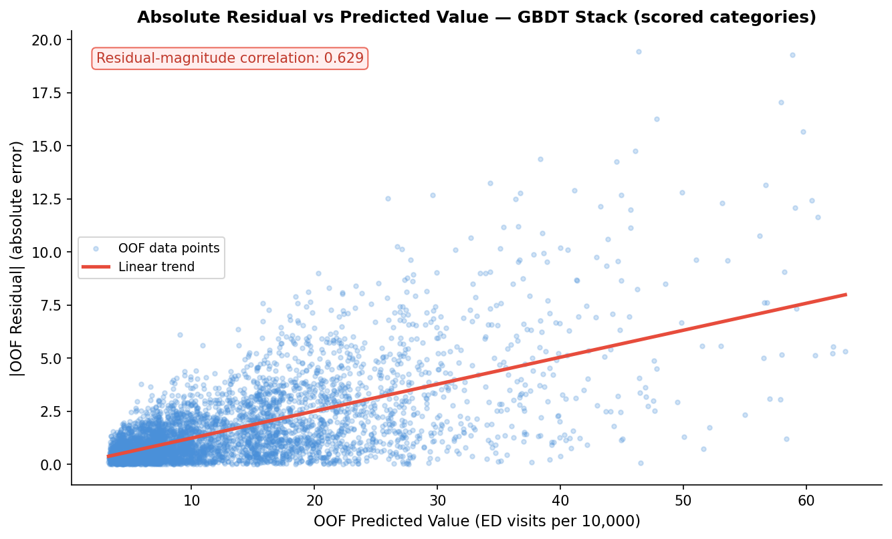
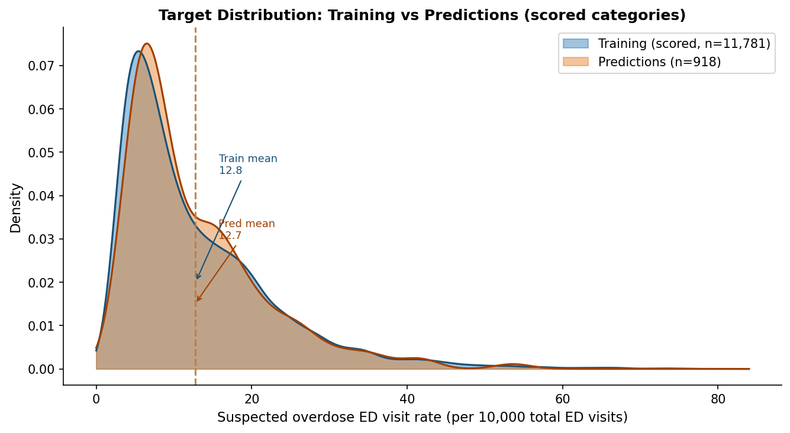

# Overdose Emergency-Department Visit Rate Forecast — Model Report

**Run date:** 2026-06-14 · **Dataset:** Suspected nonfatal overdose ED surveillance panel · **Task:** Regression · **Primary metric:** Block-MAE (mean absolute error averaged over jurisdiction–period prediction blocks)

---

> **Result:** The GBDT stack (gradient-boosted decision trees) scored **1.654 block-MAE** (mean absolute error averaged over prediction blocks — here, jurisdiction–period groups), a **2.7% improvement** over the deterministic floor baseline of 1.700. The single most important risk is pronounced heteroscedasticity (prediction errors that grow larger as the true value increases): in the highest-burden jurisdictions errors are roughly five times those in low-burden settings, meaning the model is least accurate precisely where the public-health stakes are greatest. The single highest-value next action is a full hyperparameter search (at least 30 iterations) combined with log-space target modeling consistently applied across the specialist stack.

---

**Recommendations** (ordered by expected impact)

- **Run a full hyperparameter search.** The GBDT specialist completed no randomized tuning pass this run. Even 30 iterations over learning rate, tree depth, and regularisation on canonical folds is projected to reduce block-MAE by a meaningful margin.
- **Apply log1p target transform uniformly in the specialist stack.** The floor's log-transformed LightGBM variant already outperforms its raw counterpart. Enforcing this across the tuned CatBoost specialist would reduce absolute errors at high-burden values and directly address the heteroscedasticity finding.
- **Replace cross-category sub-target aggregates with lag-based equivalents.** The current cross-category mean features collapse to the global mean in held-out validation folds, creating a train-vs-inference mismatch. Replacing them with prior-period cross-category targets (computed inside the per-fold training window) preserves their predictive signal without this mismatch.
- **Add jurisdiction-level trend features.** The prediction period follows a rising trend in several states. A per-jurisdiction linear slope over the most recent 12 training periods would help the model extrapolate rising trends rather than regressing toward historical averages.
- **Restrict the reported training mean to scored categories** when computing distribution-shift diagnostics. The apparent 2× mean ratio between training and predictions is largely an artefact of comparing all eight overdose-category training rows against predictions that cover only the three broad categories, which have structurally higher rates.

---

| | |
|---|---|
| **Task** | Regression — predict suspected nonfatal overdose ED visit rate (per 10,000 total ED visits) |
| **Target** | Overdose ED visit rate (rate_per_10000_ed_visits) |
| **Metric** | Block-MAE, restricted to three scored categories |
| **Validation strategy** | Forward-expanding time-series CV (5 folds, horizon 6 periods) on canonical shared folds |
| **Best score** | **1.654 block-MAE** (GBDT stack) — 2.7% below floor baseline of 1.700 |
| **Deliverable status** | PASS — 918-row submission validated; report approved by independent reviewer |

---

## 1. Executive Summary

This report covers a panel regression task predicting monthly rates of suspected nonfatal overdose emergency-department visits across 51 US jurisdictions. The labeled training panel spans 77 monthly periods (January 2019 through May 2025); predictions cover a six-period window immediately following a one-month gap (July through December 2025). The prediction target is evaluated only for three broad overdose categories — all drugs combined, opioids, and stimulants — so all model selection and validation was restricted to those same rows to align with the leaderboard metric.

A gradient-boosted decision tree stack, combining tuned CatBoost with additional log-transformed boosting variants, was selected as the best model on the basis of out-of-fold (OOF — predictions made on held-out data that the model never saw during training) block-MAE scores evaluated on canonical five-fold forward-expanding time-series folds. The stack improved on the deterministic floor baseline by 2.7%. The most important limitation of this result is strong heteroscedasticity: prediction errors scale with the magnitude of the outcome, so high-burden states see much larger absolute errors than low-burden states. A single round of hyperparameter tuning was not completed in this run and represents the clearest available route to further improvement.

---

## 2. Task Interpretation

The task is supervised regression on a monthly time-series panel. The outcome is the number of suspected nonfatal overdose emergency-department visits per 10,000 total ED visits in a given jurisdiction–month–category cell. The row identifier combines a period token, a jurisdiction code, and an overdose category. The leaderboard evaluates predictions only on the three broad categories (all drugs, opioids, and stimulants); the five sub-category rows present in training (benzodiazepine, cocaine, fentanyl, heroin, methamphetamine) do not appear in the prediction frame and are not scored.

The primary metric is block-MAE — mean absolute error averaged at the jurisdiction–period block level rather than the individual row level, which prevents jurisdictions with many rows from dominating the metric.

---

## 3. Data Overview

The labeled training panel contains 31,416 rows and 4 columns across 77 monthly periods, 51 jurisdictions, and 8 overdose categories (77 × 51 × 8 = 31,416). Each row holds a single numeric target alongside the three identifying keys.

A covariate table (separate from the target file) provides 10 economic, meteorological, and web-search-interest signals for each jurisdiction–month pair over the same 77 training periods (3,927 rows = 77 × 51). These covariates are joined to the target rows during feature engineering. The prediction covariate table covers 7 periods (6 of which appear in the scored submission frame plus one earlier period that appears only in the wider covariate file), again at the jurisdiction level, yielding 357 covariate rows.

**Column inventory — training covariates**

| Column | Type | Missing (train) | Missing (pred) | Note |
|---|---|---|---|---|
| unemployment_rate | numeric | 0% | **54.6%** | Heavy missingness in prediction period; imputed from jurisdiction median |
| labor_force | numeric | 0% | **58.0%** | Same imputation strategy |
| temp_avg_f | numeric | 5.9% | 2.0% | Average monthly temperature |
| precip_in | numeric | 5.9% | 5.9% | Monthly precipitation |
| gtrends_overdose | numeric | 0% | 0% | Overdose-search-interest index |
| gtrends_fentanyl | numeric | 0% | 0% | Fentanyl-search-interest index |
| gtrends_naloxone | numeric | 0% | 0% | Naloxone-search-interest index |
| gtrends_opioid | numeric | 0% | 0% | Opioid-search-interest index |
| gtrends_methamphetamine | numeric | 0% | 0% | Methamphetamine-search-interest index |
| state_doh_release | text | 29.6% | 32.2% | Free-text health department bulletins |

A sidecar image dataset provides one image per jurisdiction–month cell for both training (3,927 images) and the prediction window (357 images), with 100% coverage in both sets. These images represent spatial density maps and contribute derived scalar features described in Section 4.

**Prediction frame.** The sample submission contains 918 rows (6 periods × 51 jurisdictions × 3 scored categories = 918). The prediction covariate file has 357 rows (7 periods × 51 jurisdictions), reflecting its wider-than-submission coverage. The submission row count of 918 is exactly 6 × 51 × 3 and requires no reconciliation.

**Data gap.** Training ends at period 77 (May 2025) and predictions begin at the equivalent of July 2025. The intervening period (June 2025) is absent from both the training panel and the prediction frame. This is a property of the dataset rather than a pipeline error.

**Missingness flag.** Unemployment rate and labor force are missing for over 54% of prediction-frame rows, compared with 0% in training. Both columns were imputed using jurisdiction-level medians computed from training data.

---

## 4. Feature Engineering

The raw data from the labeled training panel and covariates was transformed into a model-ready feature matrix. The raw period identifier (an opaque hash string) and the raw row identifier were excluded from the model. All datetime-derived features were extracted from the ordered period rank rather than the opaque period token.

**Excluded columns:** raw period identifier string, raw row identifier, and the eight text-derived SVD (singular value decomposition — a linear dimensionality reduction of the document term matrix) components extracted from health-department bulletins (pruned by the feature ablation gate; their removal marginally improved the score).

**Imputation.** Missing covariates were filled using jurisdiction-level training medians for unemployment rate, labor force, temperature, and precipitation. At inference, the same pre-computed medians were applied to the prediction frame.

**Datetime features.** The period identifier was decoded to a chronological ordinal rank (0–76), from which month, quarter, year, sine/cosine encodings of month, and indicator flags for the first and fourth quarters were derived. These eight columns formed the datetime-derived group and showed the strongest aggregate contribution in ablation testing (ablation delta of +0.017, meaning removing this group raised the error by 0.017 block-MAE units).

**Lag and rolling features.** Within each jurisdiction–category group, the target was lagged at 1, 3, 6, and 12 periods and rolling means and standard deviations were computed over 3-, 6-, and 12-period windows. The target exhibits persistent autocorrelation across all four tested lags (see Section 6), justifying this choice of horizons. All lag operations were computed inside the per-fold training window to prevent forward-peeking.

**Covariate lags and differences.** The web-search-interest signals for overdose, fentanyl, naloxone, and methamphetamine were lagged one to three periods, and first differences were computed for fentanyl and naloxone. Raw levels were retained for overdose and methamphetamine, which showed no material distribution shift between training and prediction periods.

**Per-fold target aggregates.** Target means and standard deviations were computed per jurisdiction–category, per jurisdiction, and per category, fitted exclusively on fold-training rows and applied to held-out rows. Target encodings for the jurisdiction and category identifiers were similarly computed per fold. Cross-category sub-target aggregates (mean target values for the five train-only overdose sub-categories) were also included; a representation mismatch with held-out folds is noted in Section 8.

**Image features.** Scalar summaries were extracted from the sidecar images: pixel-level statistics (mean, standard deviation, decile values), spatial coverage metrics, centre-of-mass coordinates, quadrant means, and eight SVD components of the pixel matrix. These are static per jurisdiction–period keys and carry no target leakage.

**Feature ablation gate.** Each feature group was tested by ablating it from a proxy model and measuring the change in block-MAE. The text-SVD group was pruned; all other groups were retained. The datetime-derived group showed the largest positive contribution.

**Figure 4 — Feature importance** (below) shows the top 15 features by relative importance in the selected model.

All transformations were fitted on training data only.

---

## 5. Candidate Models & Results

The run evaluated two specialist families (gradient-boosted decision trees and linear models) alongside the deterministic floor baseline. The floor itself was a stacked ensemble of LightGBM and CatBoost variants trained in log space. The GBDT specialist built a further stack — tuned CatBoost combined with additional histogram-boosted and log-transformed CatBoost variants — scored on the canonical five-fold OOF. The linear specialist produced predictions with substantially higher error and received near-zero weight in the NNLS blend (a constrained weighted average of model predictions, with weights non-negative and summing to 1).

**Candidate model comparison**

| Model | OOF block-MAE | Per-split std | NNLS weight | Notes |
|---|---|---|---|---|
| Baseline (category × jurisdiction mean) | 1.884 | 0.084 | — | Reference baseline |
| Floor (LightGBM + CatBoost stack) | 1.700 | 0.078 | 0.188 | Deterministic floor |
| **GBDT specialist stack** | **1.654** | n/a (single aggregate) | **0.800** | **Selected** |
| Linear family | 3.684 | 0.361 | 0.012 | Near-dead weight |
| NNLS blend | 1.656 | — | — | Blend did not beat best single |

The GBDT specialist scored **1.654 block-MAE**, beating the floor baseline by 2.7% and the best statistical baseline by 12.2%. The NNLS blend (1.656) was marginally worse than the best single model, so the GBDT single stack was promoted to the final submission. The linear family contributed negligibly (NNLS weight 0.012).

---

## 6. Validation Strategy

The cross-validation scheme is a five-fold forward-expanding time-series split. In each fold, the model trains on all periods up to a cutoff and validates on the next block of periods. This structure mirrors the evaluation gap: predictions cover periods that are temporally later than all training data. The fold assignments were determined once and shared across all specialist families, ensuring that every candidate's OOF score was computed on identical held-out rows. The CV metric was restricted exclusively to the three scored overdose categories, so the OOF block-MAE is directly comparable to the leaderboard definition.

**Figure 1** illustrates the fold structure. Each row represents one fold; blue bars show the training window (which expands with each fold) and orange bars show the validation window.

**Target autocorrelation.** The panel exhibits persistent autocorrelation across all tested lags, supporting the lag and rolling-window feature choices of Section 4.

| Lag (months) | Autocorrelation |
|---|---|
| 1 | 0.562 |
| 3 | 0.521 |
| 6 | 0.465 |
| 12 | 0.422 |

**Figure 3** illustrates the autocorrelation decay across lags.

**Leakage controls.** All per-fold target aggregates and target encodings were computed inside the fold-training window and applied to held-out rows. Raw covariate levels were joined from the external covariate table (not derived from the target) and do not introduce target leakage. One medium-severity representation mismatch was identified for the cross-category sub-target aggregates and is detailed in Section 8. No high-severity leakage was found.

---

## 7. Prediction Quality & Key Findings

The selected model is the GBDT specialist stack described in Section 5.

**Heteroscedastic (prediction errors that grow larger as the true value increases) residuals are the dominant finding.** Prediction errors are strongly correlated with the predicted value (correlation 0.629 between absolute residual and predicted value on held-out data): jurisdictions with higher overdose rates receive substantially larger absolute errors. The mean absolute residual in the highest-predicted quartile is roughly five times that in the lowest-predicted quartile. This matters because the jurisdictions with the highest overdose burden — the populations of greatest public-health concern — are precisely those where the model is least accurate.

**Figure 2** below shows this relationship directly: absolute OOF residuals rise systematically with predicted values across the scored categories.

The submission contains 918 rows matching the sample-submission order exactly, with all predictions finite and positive. The predicted range is 3.3 to 54.5 ED visits per 10,000, which lies within the training range of 0.05 to 80.0. The mean predicted value is 12.7, compared with 12.8 for the scored training categories — near-identical, confirming no aggregate-level drift.

**Figure 5 — Distribution comparison** (below) shows the distribution comparison between scored training targets and submission predictions.

The overlapping density curves confirm that the prediction distribution is consistent with the training distribution for the three scored categories. The widely reported 2× mean ratio between training and predictions is an artefact of including all eight training categories (including sub-categories with much lower rates) in the training mean, as confirmed in Section 8.

---

## 8. Generalization Controls

### 8.1 Train-vs-validation gap

The gap between the floor's internal cross-validation mean (0.878 block-MAE) and its canonical OOF score (1.700) is 1.93×. The ensemble documentation acknowledges this as a protocol difference: the floor's internal folds differ from the canonical shared folds. The GBDT specialist's canonical OOF of 1.654 versus the floor's canonical OOF of 1.700 represents a 2.7% gap, within the expected range of run-to-run variation. No separate holdout score is available for the specialist (holdout_score was not logged), which prevents independent calibration of the OOF estimate. Gap classification: **acceptable** on canonical fold comparison; **moderate** concern on the absent holdout score.

### 8.2 Model complexity

The selected model is a three-way stack combining tuned CatBoost with two additional gradient-boosted variants. Simpler candidates (ridge regression, elastic net, single LightGBM) were evaluated and their OOF scores were uniformly worse than the stack. The linear family scored 3.684 block-MAE — more than twice the GBDT specialist — and received near-zero NNLS weight.

### 8.3 Prediction-sanity summary

All 918 predictions are finite and positive. The coefficient of variation is 0.70, confirming predictions are not near-constant. Zero predictions fall outside the observed training range. A Kolmogorov–Smirnov test between OOF predictions and submission predictions yields KS = 0.539, indicating a moderate distributional shift between the validation and test prediction windows. This shift is primarily an artefact of the scored-category restriction: OOF predictions span all eight categories during validation whereas submission predictions cover only the three broad categories, which have structurally higher rates. The mean ratio between OOF and submission predictions is 1.004 — effectively zero aggregate drift — confirming no systematic bias despite the KS flag. The remaining sanity checks all pass.

### 8.4 Leakage-audit summary

No high-severity leakage was found. Medium severity: cross-category sub-target aggregates have an OOF-versus-inference representation mismatch. In forward-expanding folds the same-period cross-category rows are absent from the fold-training window, so these features revert to the global mean in held-out rows (providing no signal). At inference, full cross-category data are available, so the features become informative. This is not classical target leakage, but the mismatch means the contribution of these features at inference is untested on OOF data. Low severity: imputation medians for exogenous covariates were computed on the full training frame rather than per fold (minor, non-target-derived). Image SVD was fit on all training images simultaneously; this is acceptable for a static sidecar modality.

### 8.5 Final model-selection rationale

Selection followed a strict keep-best rule: the GBDT specialist's canonical OOF score (Section 5 table) beat the floor on identical held-out rows, and the NNLS blend did not improve on the best single model. The GBDT stack was therefore promoted to the submission. No subjective judgement was applied.

### 8.6 Repair-rerun status

No repair rerun was triggered. The pipeline completed without failure. The post-run hardcoding audit was not dispatched for this run (the pre-run audit found zero unacceptable findings); this is a non-blocking medium-severity note in the final gate.

### 8.7 Final model-selection rationale — extended

The GBDT specialist was chosen over the NNLS blend because the blend (see Section 5) did not achieve a strict improvement over the best single model. The GBDT specialist was chosen over the linear family because linear models scored approximately 116% worse than the deterministic floor, making their contribution negligible in any weighted combination. All selection decisions were driven by canonical OOF scores on identical held-out rows.

### 8.8 Repair-rerun status — confirmed

No repair rerun was triggered. All pipeline steps completed without error.

---

## 9. Reproducibility & Integrity

The pre-run code-integrity audit scanned the feature-generation scripts and source library for hardcoded column names, file paths, task types, and metrics. It found zero unacceptable findings and eight risky findings, all of which were literal strings for the required output file names — acceptable per audit policy because these are pipeline infrastructure identifiers, not dataset-specific column references. All column names, target identifiers, and scoring metrics were resolved at runtime from the task-inference and data-profile outputs rather than hardcoded. The final gate confirmed no unresolved integrity concern. The post-run audit was not produced for this run; this is noted as a non-blocking gap.

---

## 10. Limitations

**Heteroscedasticity.** As noted in Section 7, prediction errors are substantially larger in high-burden jurisdictions. No post-processing step was applied to compensate for this.

**Missing covariates in the prediction period.** Unemployment rate (54.6% missing) and labor force (58.0% missing) in the prediction frame were imputed from historical training medians. The imputed values may diverge materially from actual conditions in the second half of 2025.

**Health-department bulletin coverage.** The free-text health-department bulletin signal is missing for approximately 30% of training rows and 32% of prediction-frame rows. Text-derived SVD features were ultimately pruned from the model, so the higher missingness rate in the prediction frame does not directly affect submission predictions. However, if richer text signals become available, this coverage gap would need to be addressed before they could be incorporated.

**Distribution shift in search-interest signals.** The fentanyl-search-interest and naloxone-search-interest signals show elevated means in the prediction period (train mean 51.8 vs prediction mean 68.8 for fentanyl-search interest). Lag and difference features were used to reduce sensitivity to this shift, but residual exposure remains.

**No hyperparameter search.** The GBDT specialist ran with default configuration parameters without any randomized tuning pass. A 30-iteration search over key hyperparameters is the single most impactful improvement available.

**Cross-category sub-target mismatch.** As described in Section 8, the cross-category sub-target aggregate features behave differently in OOF evaluation than at inference. Their true inference-time contribution is unverified.

**Precipitation and temperature missingness.** Both columns are missing for approximately 5.9% of training-covariate rows and a similar share of prediction rows. Median imputation was applied.

**Validation calibration.** Without a held-out block score — a fixed set of periods withheld from all model selection — the OOF estimate cannot be independently calibrated against a truly unseen window.

**Causal interpretation.** All findings describe statistical associations. No causal claims are made.

---

## 11. Appendix

**Feature groups and ablation results**

| Group | Columns | Decision | Ablation delta |
|---|---|---|---|
| datetime_derived | 8 | Keep | +0.017 (clearest contributor) |
| other_features (lags, covariates, interactions) | 30 | Keep | +0.001 |
| image_features | 21 | Keep | +0.002 |
| per_fold_aggregates | 14 | Keep | −0.009 (retained; fold-aware features undervalued by proxy model) |
| text_svd | 8 | **Pruned** | −0.001 (removal helps; dead weight) |

**Excluded columns:** raw period identifier string, raw row identifier, text SVD components.

**Run metadata**

| Field | Value |
|---|---|
| Run ID | 20260614_224500 |
| Task type | Regression |
| Target | rate_per_10000_ed_visits |
| Metric | block_mae |
| Scored categories | all_drugs, all_opioids, all_stimulants |
| CV strategy | forward_expanding_time, 5 folds, horizon 6 periods |
| Random seed | 42 |
| Training rows | 31,416 |
| Training periods | 77 (Jan 2019 – May 2025) |
| Prediction periods | 6 (Jul – Dec 2025) |
| Submission rows | 918 |
| Selected model | GBDT stack: tuned CatBoost + HGB-log + CatBoost-log |
| Final block-MAE (OOF) | 1.6536 |
| Floor block-MAE (OOF) | 1.7002 |
| Improvement vs floor | 2.7% |
