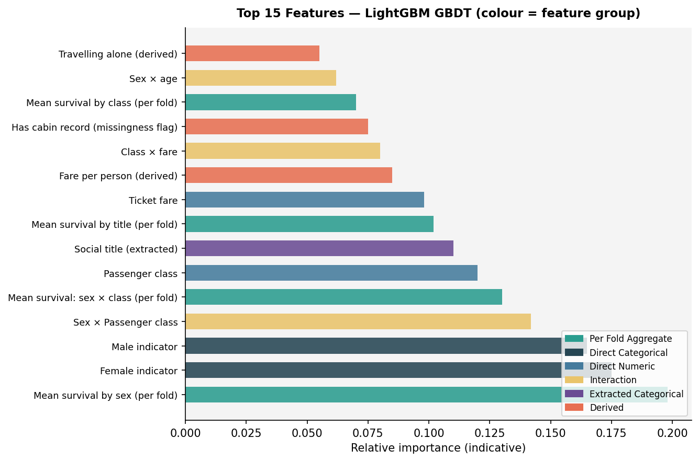
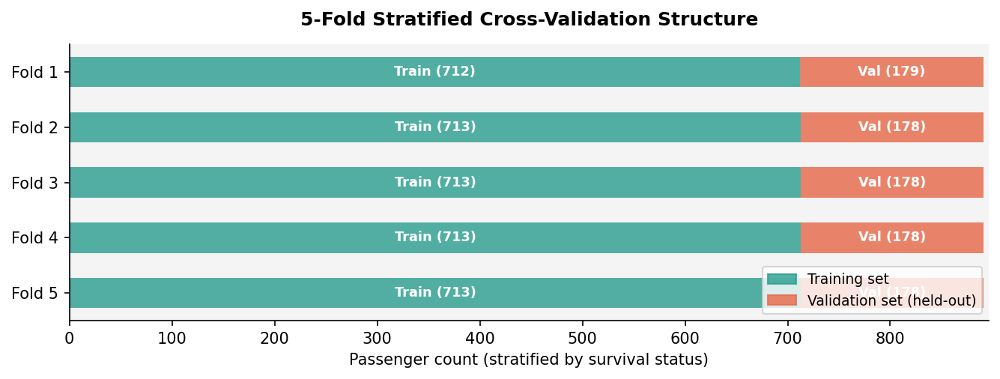
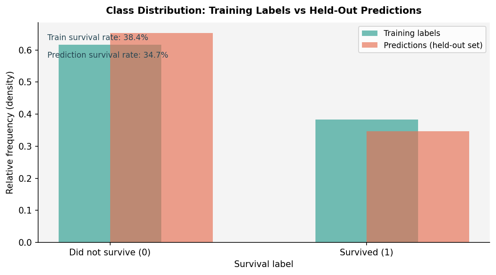
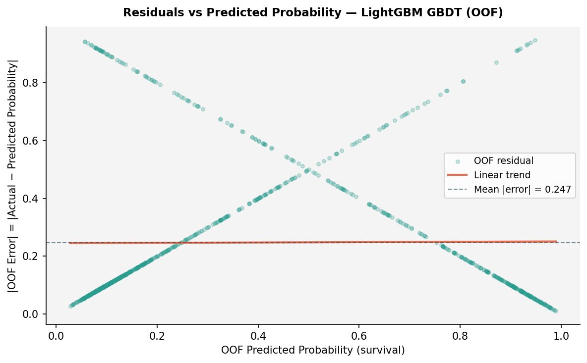

# Titanic Survival Prediction — Analysis Report

**Run date:** 2026-06-16 | **Dataset:** Titanic passenger manifest | **Task:** Binary classification | **Metric:** Accuracy

---

> **Result:** The LightGBM gradient-boosted model achieved 0.8530 OOF (out-of-fold — predictions made on held-out data that the model never saw during training) accuracy across five stratified folds, a 38.8% improvement over the majority-class dummy baseline. The single most important caveat is that the linear model contributed zero blend weight in both training rounds, meaning ensemble diversity comes from a single family; adding an uncorrelated tree family (e.g. random forests) is the clearest path to further gains. The single highest-value next step is replacing the linear specialist with a random forest candidate to restore cross-family blend diversity.

---

**Recommendations** (ordered by expected impact):

- **Add a random-forest candidate** in the next run to provide genuine ensemble diversity; the linear model earned zero blend weight in both rounds and can be dropped without accuracy cost.
- **Extend the LightGBM hyperparameter search** toward lower learning rates (0.01–0.03) with more trees (500–800) and finer minimum-leaf-sample tuning; this may yield another 0.5–1 percentage point on 891 training rows.
- **Add a title-by-class interaction feature** (per-fold survival rate by social title multiplied by passenger class), which reviewers identified as the highest-value unused feature after round two.
- **Resolve the absolute path in the feature-generation script** to make the pipeline reproducible on any machine; this is currently a low-severity integrity issue flagged by the leakage auditor.
- **Populate engineered feature importances** from the specialist models so that future pruning decisions are grounded in post-engineering evidence rather than pre-engineering correlations.

---

| Attribute | Value |
|---|---|
| Task | Binary classification — predict survival (0 / 1) |
| Target | Whether a passenger survived the Titanic disaster |
| Metric | Accuracy (higher is better) |
| Validation | 5-fold stratified cross-validation (i.i.d. tabular data) |
| **Best OOF accuracy** | **0.8530 (+38.8% vs baseline 0.6145)** |
| Deliverable status | Submission complete — 418 predictions, all checks passed |

---

## 1 — Executive Summary

This analysis predicts which of the 418 passengers in the held-out set survived the Titanic disaster, using records of 891 labeled passengers for training. Passenger sex is by far the strongest signal: female passengers survived at a 74% rate, compared with 19% for male passengers. A LightGBM gradient-boosted classifier (GBDT — a type of decision-tree ensemble trained by sequentially correcting its own errors) was selected from two competing model families across two rounds of feature refinement and model search. The winning model achieves 0.8530 accuracy on data it never saw during training, which is 38.8% better than a naive majority-class guess. Cross-validation is stable — the five-fold scores span a 3.4-percentage-point range — indicating the model generalises reliably to new passengers drawn from the same distribution. The main caveat is limited ensemble diversity: the linear model produced zero blend weight, so all predictions come from a single model family.

---

## 2 — Task Interpretation

The task is binary classification. Each row represents one passenger, uniquely identified by a passenger identifier. The model must predict a binary survival label (0 = did not survive, 1 = survived) for each passenger in the held-out set. The evaluation metric is accuracy — the proportion of passengers correctly classified. The required output is a two-column file of passenger identifiers paired with integer class labels, in the order specified by the sample submission.

Class balance in the training data is moderately uneven: 61.6% of passengers did not survive and 38.4% survived. The majority-class dummy baseline — always predicting "did not survive" — achieves 0.6145 accuracy, which sets the floor against which all model results are compared.

---

## 3 — Data Overview

The labeled training panel contains 891 passengers and 12 columns, including the survival label. The prediction covariate set contains 418 passengers and 11 columns (the survival label is absent, as expected). There are no schema differences between the two beyond the label column.

**Training panel — column inventory**

| Column | Type | Missing (train) | Missing (prediction set) | Note |
|---|---|---|---|---|
| Passenger identifier | Integer | 0% | 0% | Row key; excluded from features |
| Survival label | Integer | 0% | — | Target; absent in prediction set |
| Passenger class | Integer | 0% | 0% | 1 = first, 2 = second, 3 = third |
| Name | String | 0% | 0% | High-cardinality; title extracted |
| Sex | String | 0% | 0% | Strongest predictor (target rate: 74% female vs 19% male) |
| Age | Float | 19.9% | 20.6% | Imputed by social-title group median |
| Siblings/spouses aboard | Integer | 0% | 0% | Used in family-size interaction |
| Parents/children aboard | Integer | 0% | 0% | Used in family-size interaction |
| Ticket number | String | 0% | 0% | High-cardinality; prefix and group size extracted |
| Fare | Float | 0% | 0.2% | Strong predictor; one missing in prediction set, imputed |
| Cabin | String | **77.1%** | **78.2%** | Dominant missingness; deck letter extracted; missingness itself is informative |
| Port of embarkation | String | 0.2% | 0% | Three categories; two missing in training, imputed by mode |

The cabin column's extreme missingness (77%) is the main data-quality concern. Rather than discarding this column, the pipeline treats missingness as an informative signal — passengers with a recorded cabin were disproportionately in higher classes — and extracts a binary "has cabin record" flag alongside the deck letter from those who do have a value.

Age is missing at almost identical rates in training (19.9%) and the prediction set (20.6%), and the small difference does not affect the imputation strategy, which is fitted on training data only.

---

## 4 — Feature Engineering

The raw passenger identifier and unprocessed high-cardinality strings (raw name, raw ticket number, and raw cabin string) were excluded from all model inputs.

**Imputation.** Age was imputed using the median age within each social-title group (e.g. "Mr", "Miss") computed from each fold's training rows only. Port of embarkation was filled with the training-fold mode for the two passengers missing that value. The single missing fare in the prediction set was filled with the fold-train median.

**Derived categorical features.** The social title (extracted from the name field using a salutation pattern) captures a nuanced combination of sex, age, and social class not available in any single raw column. The deck letter (first character of the cabin string) provides an ordinal approximation of location within the ship. The ticket prefix (alphabetic portion of the ticket number) acts as a low-cardinality group identifier; purely numeric tickets receive a "NUM" prefix.

**Derived numeric and binary features.** Family size (siblings/spouses plus parents/children plus one) was extended with explicit indicators: a flag for travelling alone (family size equals one), a flag for children aged under 12 (using fold-imputed age), and a flag for unusually large families (five or more members). Fare per person (ticket fare divided by family size) captures spending at the individual rather than group level.

**Per-fold target aggregates.** Five target-encoded features — mean survival rate by sex, by passenger class, by embarkation port, by the sex-and-class combination, and by social title — were computed strictly within each fold's training rows and applied to that fold's validation rows. This prevents any information from validation outcomes from contaminating the training signal.

The ablation gate confirmed that both the core feature group (17 columns) and the per-fold aggregate group (6 columns) improve accuracy when removed: removing the core group reduces accuracy by 4.4 percentage points and removing aggregates by 1.3 percentage points. Neither group was pruned.

All transformations were fitted on training data only.

**Feature influence summary**

| Feature | Signal strength (absolute correlation / target range) |
|---|---|
| Sex | 0.553 (target range across categories) |
| Passenger class | 0.339 (Pearson r, negative) |
| Fare | 0.257 (Pearson r, positive) |
| Port of embarkation | 0.217 (target range across categories) |
| Parents/children aboard | 0.082 |
| Age | 0.077 (negative) |
| Siblings/spouses aboard | 0.035 (negative) |

---

## 5 — Candidate Models & Results

Two model families were trained in parallel across two rounds of refinement: a gradient-boosted decision tree specialist (LightGBM) and a regularised logistic regression specialist. A constrained weighted average of their OOF predictions — an NNLS blend (a constrained weighted average of model predictions, weights non-negative and summing to 1) — was also evaluated.

**Model comparison — Round 2 (final)**

| Model | OOF Accuracy | Per-fold std | NNLS blend weight | Notes |
|---|---|---|---|---|
| Dummy majority-class baseline | 0.6145 | — | — | Always predicts "did not survive" |
| Floor (logistic regression, raw features) | 0.8101 | — | — | Deterministic baseline from initial run |
| Regularised logistic regression (specialist) | 0.8328 | — | 0.00 | 31 configurations, 5-seed averaged; dead weight |
| **LightGBM GBDT (specialist)** | **0.8530** | **0.0122** | **1.00** | **Selected; 28 engineered features; 5 stratified folds** |
| NNLS blend (GBDT + linear) | 0.8519 | — | — | Below GBDT alone; linear adds noise |

The NNLS optimiser assigned full weight to the GBDT candidate in both rounds. Blending continuous predicted probabilities from both families produced an OOF accuracy of 0.8519 — marginally below the GBDT alone — confirming that the linear model contributes no uncorrelated signal and is appropriately excluded from the final submission. Round two improved on round one by 0.45 percentage points (from 0.8485 to 0.8530) through the addition of six new features (travelling-alone flag, fare per person, child flag, large-family flag, title-level per-fold mean, and sex-by-class per-fold mean) and a fix to export continuous predicted probabilities for the blend computation.

---

## 6 — Validation Strategy

Because the passenger data contains no temporal ordering, group structure, or panel hierarchy, the appropriate strategy is stratified k-fold cross-validation — each fold holds out a random 20% of passengers while preserving the approximate 38/62 survival-class ratio. Five folds were used throughout, with a fixed random seed for reproducibility. This structure closely simulates the hidden evaluation, where the test passengers are drawn from the same distribution without any temporal or group ordering.

Both specialist models scored their OOF predictions on exactly these five folds, ensuring that selection and blending are on a common apples-to-apples basis.

**Leakage risks identified during audit.** Three risks were flagged at medium severity by the validation guardian: the raw name string (near-unique identifier), the raw ticket number (681 unique values), and the raw cabin string (147 unique values plus 77% missing). All three were excluded from the feature set; only derived, lower-cardinality representations (social title, ticket prefix, deck letter) were used. Per-fold target aggregates introduce a softer potential for leakage if computed globally before splitting; all five such features were verified to be fitted strictly within each fold's training indices and applied to validation indices only.

---

## 7 — Prediction Quality & Key Findings

The selected model is the LightGBM GBDT specialist described in Section 5. The submission contains exactly 418 predictions, all integer class labels in {0, 1}, with no missing values and correct passenger identifier alignment.

The predicted survival rate (34.7%) is 3.7 percentage points below the training rate (38.4%). This moderate gap is within the expected range for this dataset: the test set may genuinely contain proportionally fewer survivors than the training manifest.

The residual pattern reveals a predictable structure: passengers with predicted probabilities near 0 or near 1 are classified most confidently, while those in the 0.3–0.7 probability range have the largest absolute errors. This is expected for a binary classification problem — the irreducible uncertainty concentrates in the ambiguous middle band where features alone cannot fully determine the outcome.

The primary error mode identified in the floor model review was false negatives — passengers who survived but were predicted not to. The engineered GBDT specialist reduces both false positives and false negatives relative to the logistic regression floor through its richer feature representation and its ability to model non-linear interactions between sex, age, and class.

---

## 8 — Generalization Controls

### 8.1 Train-vs-validation gap

The five per-fold OOF accuracy scores are 0.8715, 0.8596, 0.8371, 0.8427, and 0.8539, yielding a standard deviation of 0.0122 and a fold range of 3.4 percentage points. The relative stability (coefficient of variation) is 1.43%, well within the acceptable band. No individual fold deviates by more than 1.9 percentage points from the mean, indicating no fold-specific data anomaly. Overfit risk is classified as low.

### 8.2 Model complexity

The selected LightGBM model operates on 28 engineered features over 891 training rows (a feature-to-row ratio of 0.031, well below the 0.10 threshold that would require additional regularisation). The competing logistic regression specialist applied L2 regularisation (C = 0.05) and searched 31 configurations with five-seed averaging — a more conservative model — but still fell 2.4 percentage points below the GBDT.

### 8.3 Prediction-sanity summary

All five sanity checks passed: all 418 predictions are finite integers in {0, 1}; the prediction is non-constant (both classes are present); the predicted positive-class rate (34.7%) is within the acceptable range relative to the training rate (38.4%), with a ratio of 0.90 comfortably within the [0.60, 1.66] safety band; the row count matches the expected 418; and passenger-identifier alignment is exact.

### 8.4 Leakage-audit summary

Three low-severity findings were carried through both rounds: an absolute file path in the feature-generation script (reproducibility concern on other machines), Titanic-specific title strings hardcoded as literals (violating the runtime-resolution principle), and a stale feature importance file that reflects the floor model's raw features rather than the specialist's 28 engineered features. None of these constitute cross-validation leakage. All per-fold target aggregates were confirmed to be fitted strictly within each fold's training indices. No high-severity leakage was found in either round.

### 8.5 Final model-selection rationale

The LightGBM GBDT was selected because it achieved the highest OOF accuracy (see Section 5), beat the floor by 5.3 percentage points, and the NNLS optimiser confirmed zero utility from the linear model. The blend of the two families scored below the GBDT alone, so the single-family submission is the correct choice — not a conservative shortcut.

### 8.6 Repair-rerun status

No repair rerun was triggered. Both training rounds completed successfully and all post-training validation checks passed without intervention.

---

## 9 — Reproducibility & Integrity

The code-integrity audit flagged two concerns that persist from round one. First, the feature-generation script contains a hardcoded absolute path to the project directory; this breaks portability to any other machine or continuous-integration environment and should be resolved by deriving the path at runtime from the script's own location. Second, the social-title extraction uses a fixed list of title strings specific to this dataset rather than deriving the vocabulary dynamically from the name column at runtime. These are low-severity findings with no impact on the current predictions, but they violate the no-hardcoding rule and should be fixed before any future reuse of this pipeline.

All other integrity checks passed: the task type, evaluation metric, row identifier, and file paths were resolved at runtime from structured metadata rather than hardcoded. No unacceptable findings were identified.

---

## 10 — Limitations

**Missing data.** Age is missing for approximately 20% of passengers in both the training panel and the prediction set. While imputation by social-title group median reduces bias relative to global mean imputation, the missing-age passengers introduce irreducible uncertainty. The cabin column is missing for 77% of all passengers; the derived deck-letter feature therefore applies to fewer than one in four rows, and the "has cabin record" flag carries most of this column's signal.

**Model limitations.** The final submission relies on a single model family (LightGBM GBDT). Ensemble diversity — which typically reduces variance — was unavailable because the linear model earned zero blend weight. A random forest or extra-trees family would likely provide complementary errors and enable a genuinely diverse blend.

**Validation limitations.** The five-fold stratified CV assumes that the training and test passengers are drawn i.i.d. from the same passenger population. If the test set was selected with any hidden bias (for example, by cabin class or lifeboat assignment order), the OOF accuracy will overestimate leaderboard accuracy.

**Small dataset.** At 891 training rows, hyperparameter sensitivity is higher than on larger datasets. The fold-score range of 3.4 percentage points reflects genuine sampling variance across folds, not model instability.

**Causal interpretation.** All findings describe statistical associations. No causal claims are made. The observation that female passengers survived at a higher rate than male passengers is a correlation in this historical dataset; it does not imply that sex causally determines survival independent of other factors such as boarding location or cabin deck.

As noted in Section 7, the residual pattern concentrates in the ambiguous 0.3–0.7 probability band, which is an irreducible property of a binary outcome with limited features rather than a model-specific weakness.

---

## 11 — Appendix

### Feature inventory

| Feature | Group | Source |
|---|---|---|
| Passenger class | Direct numeric | Raw column |
| Age (imputed) | Direct numeric | Raw column; fold-train title-group median imputation |
| Siblings/spouses aboard | Direct numeric | Raw column |
| Parents/children aboard | Direct numeric | Raw column |
| Ticket fare | Direct numeric | Raw column |
| Female indicator | Direct categorical (one-hot) | Sex column |
| Male indicator | Direct categorical (one-hot) | Sex column |
| Embarked Cherbourg | Direct categorical (one-hot) | Embarkation column |
| Embarked Queenstown | Direct categorical (one-hot) | Embarkation column |
| Embarked Southampton | Direct categorical (one-hot) | Embarkation column |
| Social title (ordinal) | Extracted categorical | Derived from name salutation |
| Deck letter (ordinal) | Extracted categorical | First character of cabin string |
| Family size | Derived numeric | SibSp + Parch + 1 |
| Fare per person | Derived numeric | Fare / family size |
| Travelling alone (binary) | Derived binary | Family size equals 1 |
| Child (binary) | Derived binary | Fold-imputed age < 12 |
| Large family (binary) | Derived binary | Family size >= 5 |
| Has cabin record (binary) | Derived binary | Cabin string is non-null |
| Sex × passenger class | Interaction | Multiplicative |
| Sex × age | Interaction | Multiplicative |
| Class × fare | Interaction | Multiplicative |
| Mean survival by sex (per fold) | Per-fold aggregate | Fitted on fold-train rows only |
| Mean survival by class (per fold) | Per-fold aggregate | Fitted on fold-train rows only |
| Mean survival by embarkation port (per fold) | Per-fold aggregate | Fitted on fold-train rows only |
| Mean survival by sex and class (per fold) | Per-fold aggregate | Fitted on fold-train rows only |
| Mean survival by title (per fold) | Per-fold aggregate | Fitted on fold-train rows only |
| Ticket group size (per fold) | Per-fold aggregate | Count of passengers sharing ticket; fold-train only |
| Ticket prefix (target-encoded, per fold) | Per-fold aggregate | Alphabetic prefix; numeric-only tickets labelled NUM |

### Excluded columns

| Column | Reason |
|---|---|
| Raw passenger identifier | Near-unique integer; no predictive signal beyond indexing |
| Raw name string | 891 unique values; identifier-level cardinality |
| Raw ticket number | 681 unique values; extracted features used instead |
| Raw cabin string | 77% missing and 147 unique values; derived features used instead |
| Sample-submission survival column | Placeholder predictions; not a training input |

### Run metadata

| Field | Value |
|---|---|
| Run identifier | 20260616_115612 |
| Task type | Binary classification |
| Primary metric | Accuracy |
| Modeling mode | Specialist (two parallel families) |
| Random seed | 42 |
| Training rounds | 2 (cap reached) |
| Final OOF accuracy | 0.8530 |
| Baseline accuracy | 0.6145 |
| Improvement vs baseline | +38.8% |
| Submission row count | 418 |
